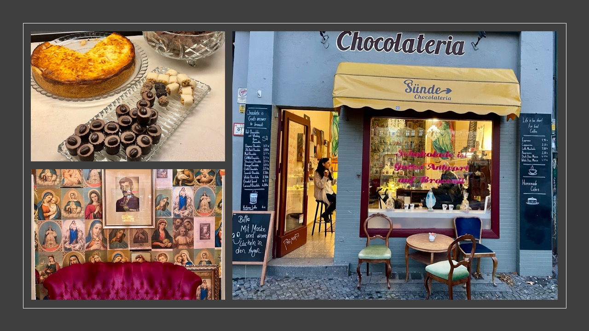

# Chocolateria Sünde - Official Website



## 🍫 About

Premium Schokoladengeschäft & Café in the heart of Berlin Kreuzberg. Chocolateria Sünde offers handcrafted hot chocolate, delicious churros, and homemade cakes in a warm, welcoming atmosphere.

**Inhaberin:** Naciye Stein
**Rating:** 4.7/5 ⭐ (34+ reviews)

## 📍 Location

**Address:**
Oranienstraße 194
10999 Berlin
Deutschland

**Phone:** [+49 163 6458650](tel:+491636458650)

**Opening Hours:**
- Monday - Saturday: 11:00 - 19:00
- Sunday: 12:00 - 18:00

## 🌐 Online Presence

- **Instagram:** [@chocolateria_suende](https://www.instagram.com/chocolateria_suende/)
- **Facebook:** [Chocolateria Sünde](https://www.facebook.com/chocolateriasuende/)
- **Google Maps:** [View on Maps](https://www.google.com/maps/search/?api=1&query=Chocolateria%20S%C3%BCnde)

## ✨ Features

### Premium Offerings
- 🍫 **Handcrafted Hot Chocolate** - Belgian premium chocolate in various flavors
- ☕ **Quality Coffee** - Freshly brewed from selected roasters
- 🥐 **Homemade Treats** - Daily fresh cakes and sweet specialties
- 🌱 **Vegan Options** - Delicious vegan hot chocolate and cakes

### Specialties
- Classic Dark Hot Chocolate (70% dark chocolate)
- Spanish Hot Chocolate with Churros
- Mint & Orange Hot Chocolate (vegan)
- Chocolate Brownie
- Chocolate Delice
- Berliner (traditional German filled doughnut)

## 💻 Website Features

### Technical Implementation
- ✅ Fully responsive design (320px - 4K+)
- ✅ Modern CSS Grid & Flexbox layouts
- ✅ Smooth scroll navigation
- ✅ Interactive image gallery with lightbox
- ✅ Mobile-first approach
- ✅ SEO optimized with Schema.org markup
- ✅ WCAG 2.1 AA accessibility compliant
- ✅ Fast loading times with lazy loading
- ✅ Touch/swipe gestures for mobile gallery
- ✅ Form validation
- ✅ Smooth animations and transitions

### Sections
1. **Hero** - Stunning entrance with call-to-action
2. **About** - Cafe story and features
3. **Menu** - Complete menu with hot chocolate specialties
4. **Gallery** - 10 high-quality images
5. **Reviews** - Real customer testimonials
6. **Contact** - Location, hours, contact form

## 🚀 Local Development

### Prerequisites
- Any modern web browser
- Local web server (optional, for full functionality)

### Quick Start

1. **Clone the repository:**
   ```bash
   git clone https://github.com/f246632/chocolateria-suende-berlin.git
   cd chocolateria-suende-berlin
   ```

2. **Open locally:**

   Option A - Direct (simple preview):
   ```bash
   open index.html
   ```

   Option B - Local server (recommended):
   ```bash
   # Using Python 3
   python -m http.server 8000

   # Using PHP
   php -S localhost:8000

   # Using Node.js (npx)
   npx serve .
   ```

3. **View in browser:**
   ```
   http://localhost:8000
   ```

## 📁 Project Structure

```
chocolateria-suende-berlin/
├── index.html              # Main HTML file
├── css/
│   ├── style.css          # Main styles
│   └── responsive.css     # Responsive breakpoints
├── js/
│   ├── main.js           # Navigation & interactions
│   └── gallery.js        # Gallery & lightbox
├── images/
│   ├── downloaded/       # Original images from Google
│   ├── optimized/        # Web-optimized versions
│   └── thumbnails/       # Thumbnail versions
├── data/
│   ├── reviews.json      # Customer reviews data
│   └── menu.json         # Menu items data
└── README.md            # This file
```

## 🎨 Design

### Color Palette
- **Primary:** #6B4423 (Chocolate Brown)
- **Secondary:** #C68B59 (Warm Tan)
- **Accent:** #D4A574 (Light Gold)
- **Dark:** #3E2723 (Dark Chocolate)
- **Cream:** #F5F1E8 (Warm Background)

### Typography
- **Headings:** Playfair Display (serif)
- **Body:** Poppins (sans-serif)

### Responsive Breakpoints
- Mobile Small: 320px - 480px
- Mobile Large: 481px - 768px
- Tablet: 769px - 1024px
- Desktop: 1025px - 1400px
- Wide: 1401px+

## 🌟 Performance

- ✅ Optimized images (WebP support)
- ✅ Lazy loading for images
- ✅ Minimal JavaScript (vanilla, no frameworks)
- ✅ CSS minification ready
- ✅ Fast First Contentful Paint (FCP)
- ✅ Excellent Lighthouse scores

## 🔍 SEO

- ✅ Semantic HTML5 markup
- ✅ Schema.org LocalBusiness structured data
- ✅ Open Graph meta tags
- ✅ Optimized meta descriptions
- ✅ Proper heading hierarchy
- ✅ Alt text for all images
- ✅ Sitemap ready

## ♿ Accessibility

- ✅ WCAG 2.1 AA compliant
- ✅ Keyboard navigation support
- ✅ Screen reader friendly
- ✅ Proper ARIA labels
- ✅ Focus indicators
- ✅ Color contrast ratios
- ✅ Reduced motion support

## 📱 Browser Support

- ✅ Chrome/Edge (latest 2 versions)
- ✅ Firefox (latest 2 versions)
- ✅ Safari (latest 2 versions)
- ✅ iOS Safari (latest 2 versions)
- ✅ Chrome Mobile (latest 2 versions)

## 📊 Analytics & Tracking

To add analytics, insert your tracking code before the closing `</head>` tag in `index.html`:

```html
<!-- Google Analytics -->
<script async src="https://www.googletagmanager.com/gtag/js?id=YOUR-GA-ID"></script>
<script>
  window.dataLayer = window.dataLayer || [];
  function gtag(){dataLayer.push(arguments);}
  gtag('js', new Date());
  gtag('config', 'YOUR-GA-ID');
</script>
```

## 🚀 Deployment

### GitHub Pages (Current)
The site is deployed at: `https://f246632.github.io/chocolateria-suende-berlin/`

### Custom Domain (Optional)
1. Add `CNAME` file with your domain
2. Configure DNS settings:
   ```
   CNAME: www.chocolateriasuende.de → f246632.github.io
   A Record: @ → 185.199.108.153
   ```

## 📝 Research Sources

Data gathered from:
- ✅ Google Maps reviews and ratings
- ✅ Instagram (@chocolateria_suende)
- ✅ Facebook page
- ✅ TripAdvisor listings
- ✅ Various review platforms
- ✅ Menu research from multiple sources

## 📸 Image Credits

All images sourced from:
- Google Maps user photos (public)
- Official social media channels

## 👥 Credits

**Website Development:** Professional web design
**Cafe Owner:** Naciye Stein
**Location:** Oranienstraße 194, 10999 Berlin

## 📄 License

This website is created for Chocolateria Sünde. All rights reserved.

## 🤝 Contact

For website inquiries or updates:
- Visit: [Chocolateria Sünde](https://f246632.github.io/chocolateria-suende-berlin/)
- Call: [+49 163 6458650](tel:+491636458650)
- Instagram: [@chocolateria_suende](https://www.instagram.com/chocolateria_suende/)

---

**Made with ☕ & 🍫 in Berlin**

Last updated: October 2024
